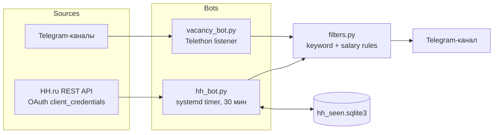

# Vacancy Bot


Два независимых бота на Python, которые мониторят вакансии под конкретный профиль (Project/Program Manager, финтех/госсектор, 1С/ERP) и присылают подходящие в Telegram — без ручного пролистывания десятков каналов и поиска на HH.ru.

## 🎯 Проблема

Поиск работы на уровне «руководитель программы проектов» — это десятки Telegram-каналов с вакансиями и HH.ru, где 90% публикаций не подходят по функции, уровню или отрасли. Ключевые слова в заголовке не спасают: «менеджер проекта» может значить как PM в финтехе, так и менеджера по продажам с расширенным названием должности.

## 💡 Решение

Два бота, объединённых общей логикой фильтрации:

- **`vacancy_bot.py`** — слушает 20+ Telegram-каналов с вакансиями в реальном времени (Telethon user-session) и пересылает подходящие в отдельный канал.
- **`hh_bot.py`** — раз в 30 минут опрашивает HH.ru и присылает новые вакансии из той же выборки.

Оба используют один модуль `filters.py`: чёрный список (junior-позиции, не те отрасли, разработка, HR, резюме вместо вакансий), белый список ключевых слов с весами и порог зарплаты.

### Нетривиальные решения по пути

- **API HH.ru для соискателей был закрыт с 15.12.2025**, что временно потребовало обхода через публичный RSS-экспорт поиска + JSON-LD со страницы вакансии. После получения официального OAuth-приложения (client_credentials) доступ восстановился — `hh_bot.py` работает через `api.hh.ru` напрямую: точный поиск по региону/дате публикации с пагинацией вместо жёсткого топ-20 у RSS, структурированные поля (зарплата, город, опыт, роль) вместо regex по свободному тексту.
- **HH отклоняет повторный запрос токена, если предыдущий ещё не истёк** (`403 "app token refresh too early"`) — обнаружено вживую при тестировании. Поскольку `hh_bot.py` обычно перезапускается с нуля каждый цикл (systemd timer), токен кэшируется не только в памяти, но и на диске (`hh_token_cache.json`, в `.gitignore`), иначе почти каждый запуск падал бы на старте.
- **Разная гранулярность фильтра для разных источников.** Чёрный список тюнился под короткие посты в Telegram-каналах (~200-500 символов). На полных официальных описаниях HH.ru (2000+ символов) те же слова давали почти 100% ложных срабатываний — например, «образование» как требование к кандидату матчилось с фильтром на «обучение». Решение: для HH-вакансий чёрный список сканирует только вступление (title + первые 400 символов), а не весь текст.
- **Русская морфология ломает наивный substring-match.** Слово `продажи` не матчилось с `«сопровождения продаж»` из-за разных окончаний. Там, где это важно, список использует основы слов (`продаж` вместо `продажи`), а не точные словоформы. Та же ловушка — на уровне поискового запроса HH: фраза `"руководитель проектов"` не находит заголовок «Руководитель **проектного офиса**» (другая словоформа), пришлось отдельно добавлять `"проектный офис"` в `HH_SEARCH_TEXT`.
- **Дедупликация без внешней БД.** `hh_seen.sqlite3` хранит ID уже просмотренных вакансий — каждый запуск обрабатывает только дельту, ничего не присылается повторно. Там же таблица `meta` хранит `last_cutoff` между опросами, чтобы `hh_bot.py` не пересканировал одно и то же окно и не пропускал вакансии между циклами.

## 🏗 Архитектура



## 🔧 Технологии

| Технология | Роль | Почему |
|---|---|---|
| [Telethon](https://docs.telethon.dev/) | Telegram user-client | Слушает приватные/публичные каналы и шлёт сообщения от имени пользователя, без ограничений Bot API на чтение каналов |
| `api.hh.ru` (OAuth `client_credentials`) | Источник вакансий HH.ru | Официальный поиск с пагинацией и структурированными полями (зарплата, регион, опыт, роль) вместо regex по свободному тексту |
| SQLite | Дедуп + курсор опроса | `seen` — ID уже отправленных вакансий, `meta` — `last_cutoff` между циклами опроса HH.ru |
| systemd (`.service` + `.timer`) | Планировщик и supervisor | Автоперезапуск при падении, `OnCalendar` вместо монотонных таймеров (последние ненадёжны в контейнерном окружении) |

## 🤔 Что сознательно не стали делать

- **LLM-оценку соответствия резюме** — рассматривали (см. подход в [статье про AI-агента для поиска работы](https://vc.ru/id6020234/3012410-ai-avtomatizatsiya-poiska-raboty)), но для этой задачи явные правила прозрачнее, дешевле и не требуют API-ключа.
- **Ранжирование вакансий** — бот присылает всё, что прошло порог, без сортировки по релевантности; список короткий, сортировка не нужна.
- **Автоотклик с сопроводительным письмом** — самая частая следующая идея, но осознанно отложена: HH.ru активно борется с автоматизацией откликов, риск ограничения/бана аккаунта не оправдан для личного использования.

## Быстрый старт

```bash
git clone <this-repo>
cd vacancy_bot
python3 -m venv venv && source venv/bin/activate
pip install -r requirements.txt
cp .env.example .env  # заполнить своими значениями
python3 vacancy_bot.py    # первый запуск запросит код подтверждения Telegram
python3 hh_bot.py --once --dry-run  # проверить фильтр без отправки
```

`.env` должен содержать `API_ID`, `API_HASH`, `PHONE` (данные Telegram-приложения с [my.telegram.org](https://my.telegram.org)) и `TARGET_CHANNEL`. Для `hh_bot.py` дополнительно нужны `HH_CLIENT_ID`/`HH_CLIENT_SECRET` — OAuth-приложение создаётся на [dev.hh.ru](https://dev.hh.ru/admin). Список отслеживаемых Telegram-каналов и поисковый запрос HH.ru настраиваются в `config.py`.

## Лицензия

MIT
